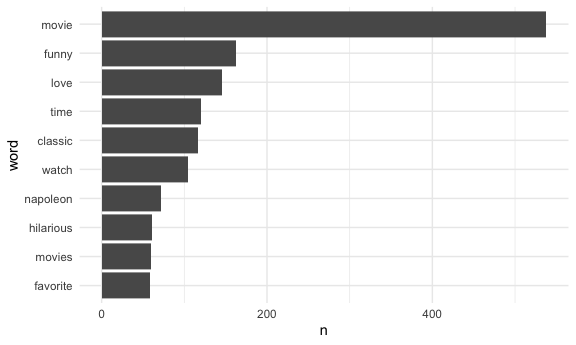

Tidy Text
================
Binyam Yilma
12/28/2020

Setup

``` r
library(tidyverse)
```

    ## ── Attaching packages ─────────────────────────────────────────────────────────────────────────────────── tidyverse 1.3.0 ──

    ## ✓ ggplot2 3.3.2     ✓ purrr   0.3.4
    ## ✓ tibble  3.0.1     ✓ dplyr   1.0.0
    ## ✓ tidyr   1.1.0     ✓ stringr 1.4.0
    ## ✓ readr   1.3.1     ✓ forcats 0.5.0

    ## ── Conflicts ────────────────────────────────────────────────────────────────────────────────────── tidyverse_conflicts() ──
    ## x dplyr::filter() masks stats::filter()
    ## x dplyr::lag()    masks stats::lag()

``` r
library(tidytext)

library(rvest)
```

    ## Loading required package: xml2

    ## 
    ## Attaching package: 'rvest'

    ## The following object is masked from 'package:purrr':
    ## 
    ##     pluck

    ## The following object is masked from 'package:readr':
    ## 
    ##     guess_encoding

## Get Data

``` r
read_page_reviews <- function(url) {
  
  html = read_html(url)
  
  review_titles = 
    html %>%
    html_nodes(".a-text-bold span") %>%
    html_text()
  
  review_stars = 
    html %>%
    html_nodes("#cm_cr-review_list .review-rating") %>%
    html_text() %>%
    str_extract("^\\d") %>%
    as.numeric()
  
  review_text = 
    html %>%
    html_nodes(".review-text-content span") %>%
    html_text() %>% 
    str_replace_all("\n", "") %>% 
    str_trim()
  
  tibble(
    title = review_titles,
    stars = review_stars,
    text = review_text
  )
}

url_base = "https://www.amazon.com/product-reviews/B00005JNBQ/ref=cm_cr_arp_d_viewopt_rvwer?ie=UTF8&reviewerType=avp_only_reviews&sortBy=recent&pageNumber="

dynamite_reviews = 
  tibble(
    page = 1:100,
    urls = str_c(url_base, page)) %>% 
  mutate(reviews = map(urls, read_page_reviews)) %>% 
  unnest(reviews) %>%
  mutate(review_num = row_number()) %>% 
  relocate(page, review_num)
```

## Do some tidy text stuff

Extracting words from the `text` field from the dynamite\_reviews
dataframe. 1 - can I extract the words? Yes.

``` r
dynamite_words = 
  dynamite_reviews %>% 
  unnest_tokens(word, input = text) %>% 
  select(-urls)
```

2 - can I remove unnecessary words?

``` r
dynamite_words = 
  anti_join(dynamite_words, stop_words) # getting rid of stop words from our words - the anti-join here is saying, keep everything in this data frame that's not in the list of the "stop_words"
```

    ## Joining, by = "word"

``` r
stop_words %>% View()
```

Usual tidyverse stuff …

``` r
dynamite_words %>% 
  count(word, sort = TRUE) %>% 
  top_n(10) %>% 
  mutate(
    word = fct_reorder(word, n)
  ) %>% 
  ggplot(aes(y = word, x =n)) +
  geom_bar(stat = "identity")
```

    ## Selecting by n

<!-- -->
